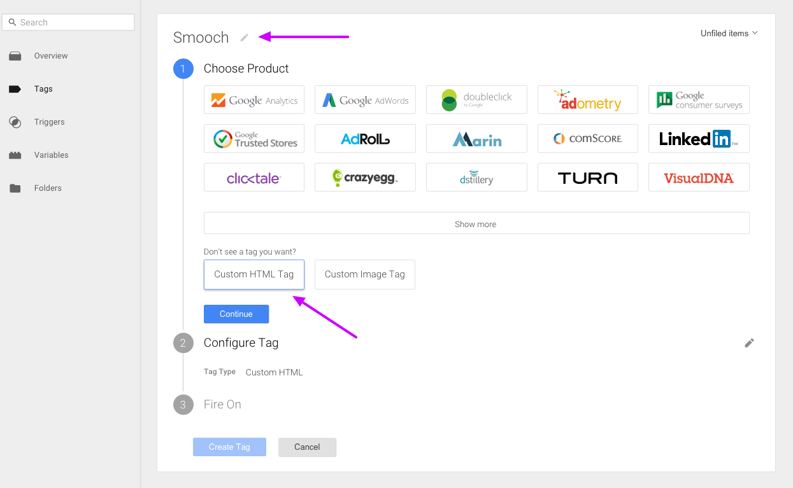

# Adding Smooch to your site


There are a few ways you can include the Smooch plugin on your web page.

The easiest way to get started is using the Script Tag method, but you can also include it using bower or npm.


## Script Tag Method

####Step 1: Include the Smooch plugin on your web page

Add the following code towards the end of the `body` section on your page. Placing it at the end allows the rest of the page to load first.

```html
<script src="https://cdn.smooch.io/smooch.min.js"></script>
```

####Step 2: Initialize Smooch with your new app token

Once Smooch has been included on your web page, you're almost done. Simply initialize the plugin using this code snippet

```html
<script>
	Smooch.init({appToken: 'your_app_token'});
</script>
```

## npm and browserify

```
npm install smooch
```

In your code:

```javascript
var Smooch = require('smooch');

Smooch.init({appToken: 'your_app_token'});
```

## bower

```
bower install smooch
```

In your code:

```javascript
Smooch.init({appToken: 'your_app_token'});
```
## Google Tag Manager

You can load Smooch's web widget through [Google Tag Manager](https://www.google.com/analytics/tag-manager/). Simply connect to your Google Tag Manager account, go inside your container and follow the guide below.

### 1. Create a new Tag and give it a cute name like "Smooch"

On your Google Tag Manager dashboard, create a new tag and rename it "Smooch".


### 2. Select "Custom HTML Tag"

At the end of the product list, click on "Customer HTML Tag" and continue.



### 3. Paste Smooch's code snipet

Paste the code below in the suggested text field. Make sure to replace 'your-app-token' with your Smooch's app token.

```html
<script src="https://cdn.smooch.io/smooch.min.js"></script>
<script>
    Smooch.init({ appToken: 'your-app-token'});
</script>
```


### 4. Select to Fire On "All Pages"

Choose the trigger "All Pages" to fire the initialization of our widget when the page loads.


### 5. Save Tag and Publish

You're almost there. Save your Tag and don't forget to publish your changes. You could need to clear the recent the cache and reload your web page to see the widget.

## Wordpress

To install Smooch on your Wordpress site, you need to [download our plugin](https://github.com/smooch/smooch-wordpress) and install it through Wordpress.

1. Download the ZIP from our [plugin github page](https://github.com/smooch/smooch-wordpress)
2. Connect on your Wordpress dasboard and go on the plugin section
3. Click on "Add New" and then "Upload Plugin"

	

4. Choose the plugin and click on "Install Now".

## Ghost

You are wondering how to load our widget on your Ghost blog. First connect to your Ghost dashboard (your-website.com/ghost). Go to the Code Injection menu (on the navigation left bar).

In the Blog Footer section, paste our initialization code.

```html
<script src="https://cdn.smooch.io/smooch.min.js"></script>
<script>
    Smooch.init({ appToken: 'your-app-token'});
</script>
```


And don't forget to click on Save!
